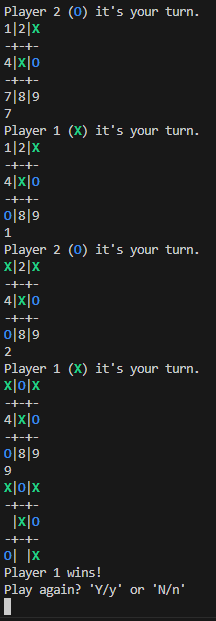

# tic-tac-toe
This project was made for [https://www.codecademy.com] in order to make a tic-tac-toe game project using C++.

This project's makefile is used for MSYS2([https://www.msys2.org]) under Windows.
https://www.codecademy.com/article/cpp-compile-execute-locally was used to run with MSYS2. Type `make all` in an MSYS2 shell to build and run the program.
However, you can just type `g++ main.cpp tic-tac-toe.cpp` to build it.

